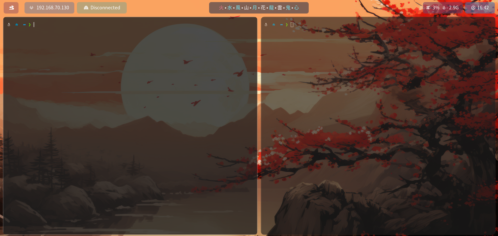

# KANJI-POLYBAR



Una configuración minimalista y temática para **Polybar**, diseñada para
entornos estilo *hacker*, estética japonesa y una presentación limpia y
funcional.\
Incluye módulos útiles para el día a día, un enfoque visual basado en
kanjis como indicadores del *window manager* y soporte completo para
scripts personalizados.

## ✨ Características principales

-   **Launcher central**: botón principal que abre tu gestor de
    contenido.
-   **Módulo de IP**: muestra tu IP local/externa.
-   **Módulo VPN**: indicador automático que muestra si la VPN está
    activa o no.
-   **Kanjis como Workspaces**: representación visual de los escritorios
    de **bspwm** mediante kanjis.
-   **Uso del sistema**: módulo combinado de **RAM** y **CPU** en tiempo
    real.
-   **Reloj minimalista**: configurable y fácil de mover.
-   **Completamente personalizable**: colores, opacidades, módulos y
    scripts pueden ajustarse fácilmente.
-   **Plug & Play**: clona el repo, coloca la carpeta y funciona de
    inmediato.

## 📁 Estructura del proyecto

    KANJI-POLYBAR/
    │── config.ini
    │── modules.ini
    │── launch.sh
    │── scripts/
    │     ├── (scripts personalizados)
    │     └── ...
    └── README.md

## 🔧 Requisitos

El único requisito adicional son las **fuentes**, ya que varios iconos y
caracteres dependen de ellas.

### Fuentes utilizadas

    font-0 = "Noto Sans CJK JP:pixelsize=14;2"
    font-1 = "JetBrainsMono Nerd Font:size=12;2"
    font-2 = "Noto Color Emoji:pixelsize=12;2"

## ⬇️ Instalación de fuentes

### 🐦 Parrot OS / Kali / Debian / Ubuntu

``` bash
sudo apt update
sudo apt install fonts-noto-core fonts-noto-cjk fonts-noto-color-emoji
```

**JetBrainsMono Nerd Font:**

``` bash
sudo apt install fonts-jetbrains-mono
```

### 🟦 Arch Linux / Endeavour / Manjaro

``` bash
sudo pacman -S noto-fonts noto-fonts-cjk noto-fonts-emoji
```

**JetBrainsMono Nerd Font:**

``` bash
yay -S nerd-fonts-jetbrains-mono
```

## 🚀 Instalación

``` bash
git clone https://github.com/tuusuario/KANJI-POLYBAR ~/.config/polybar
```

O copiar los archivos dentro de:

    ~/.config/polybar/

## ▶️ Lanzar la barra

``` bash
/home/usuario/.config/polybar/./launch.sh &
```

## 🎨 Tabla de Opacidades (HEX → %)

  Alfa (Hex)   Opacidad   Ejemplo
  ------------ ---------- -------------
  `BF`         75%        `#BF1D1F28`
  `99`         60%        `#991D1F28`
  `80`         50%        `#801D1F28`
  `66`         40%        `#661D1F28`
  `44`         26%        `#441D1F28`

## 🖼️ Capturas de pantalla

`<imagen>`{=html}\
`<imagen>`{=html}\
`<imagen>`{=html}

## 📜 Licencia

Este proyecto no tiene licencia asignada aún. Recomiendo usar **MIT**,
**GPL-3.0** o **Apache-2.0**.

